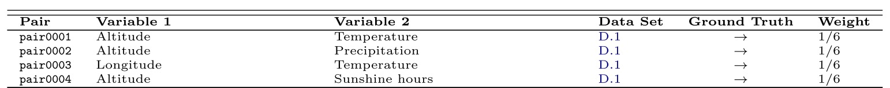
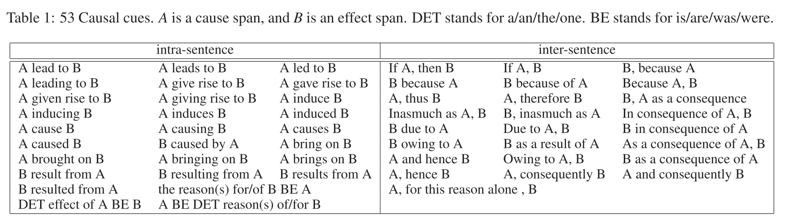

# The overview of awesome causality dataset 

The overview is about the decription of causality dataset, which is widely applied in causality relevant tasks, such as the semEval challenges.

## SemEval series
	SemEval (Semantic Evaluation) is an ongoing series of evaluations of computational semantic analysis systems; it evolved 
	from the Senseval word sense evaluation series. Started from SemEval-2007 to SemEval-2020. ---Wikipedia
	
### Dataset-1 (SemEval-2010 Task 8: Multi-Way Classification of Semantic Relations Between Pairs of Nominals.)

The dataset is used in the paper [[1]](#1), [[6]](#6), the relations from the dataset are classified into 10 categories:
- Cause-effect
- Component-whole
- Entity-destination
- Entity-origin
- Product-producer
- Member-collection
- Message-topic
- Content-container
- Instrument-agency
- Other

**Information**:

This dataset contains 10,674 samples, of which 1,325 causal.

**Example**:

	Sentence: ”The current view is that the chronic <e1>inflammation</e1> in the distal part of the stomach caused by 
		   Helicobacter pylori <e2>infection</e2> results in an increased acid production from the non-infected 
		   upper corpus region of the stomach.”
	Cause-Effect: (e2,e1)
	Comment:
Dataset Github: https://github.com/sahitya0000/Relation-Classification

Dataset Paper: https://www.aclweb.org/anthology/S10-1006.pdf

**Comment**:

	The causal pairs can be used directly by selecting cause-effect relation only.
	
### Dataset-2 (SemEval-2012 Task #7: COPA: Choice Of Plausible Alternatives.)

Open-domain commonsense reasoning (COPA), focusing specifically on commonsense causal reasoning about everyday events. The Dataset is used in the paper[[3]](#3).

**Example**:

	Premise: The man broke his toe. What was the CAUSE of this? 
	Alternative 1: He got a hole in his sock. 
	Alternative 2: He dropped a hammer on his foot.

**Pre-processing**:

	Effect Event: <man, broke, toe>
	False Cause Event 1: <Hole, sock>
	True Cause Event 2: <Dropped, hammer, foot>
	
Dataset Website: https://www.cs.york.ac.uk/semeval-2012/task7/index.html

Dataset Paper: https://www.aclweb.org/anthology/S12-1052.pdf

### Dataset-3 (SemEval-2020 Task5: Modelling Causal Reasoning in Language: Detecting Counterfactuals.)

**Information**:

**Example**:

	sentence: If that was my daughter, I would have asked If I did something wrong.
	antecedent: If that was my daughter
	consequent: I would have asked If I did something wrong.
	antecedent_start: 0
	antecedent_end: 22
	consequent_start: 23
	consequent_end: 67

**Pre-preprocessing**:

	Conditional/Hypothetical Cause event: <was, my daughter>
	Effect event: <asked, did, wrong>

Dataset Website: https://competitions.codalab.org/competitions/21691

### Dataset-4 (Causal-TimeBank (CausalTB))

Causal-TimeBank is the TimeBank corpus taken from [TempEval-3 task](https://www.cs.york.ac.uk/semeval-2013/task1/), which is part of TempEval-3 English training data: TBAQ-cleaned, annotated with causal information. ---(From official website)

**Information**:

The resulting dataset contains 2,470 sentences, of which 244 are causal.

**Example**:

_Sentence_: But the group began to **fall** apart in mid-1996 after the **defection** of one of its top leaders.

	<token id="538" number="537" sentence="17">fall</token>
	<token id="544" number="543" sentence="17">defection</token>
	
	<Markables>
		<EVENT aspect="NONE" certainty="" class="OCCURRENCE" comment="" factuality="" id="79" modality="NONE" polarity="POS" pos="VERB" tense="INFINITIVE">
			<token_anchor id="538"/>
		</EVENT>
		<EVENT aspect="NONE" certainty="" class="OCCURRENCE" comment="" factuality="" id="81" modality="NONE" polarity="POS" pos="NOUN" tense="NONE">
			<token_anchor id="544"/>
		</EVENT>
	</Markables>
	
	#Realtions
	<Relations>
		<TLINK comment="" id="56" relType="AFTER">
			<source id="79"/>
			<target id="81"/>
		</TLINK>
	</Relations>

**Preprocessing**:

	XML format event and relations extraction.

Dataset Website: https://hlt-nlp.fbk.eu/technologies/causal-timebank
Dataset Paper: http://www.aclweb.org/anthology/W14-0702

### Dataset-5 (Event StoryLine (EventSL)):

**Information**:

The resulting dataset contains 4,107 sentences, of which 77 are causal.

**Example**:

Dataset Paper: https://www.aclweb.org/anthology/W17-2711.pdf

### Dataset-6 (BioCausal):
 
**Information**:

**(BioCausal-Large)** It contains 13,342 sentences from PUBMED, of which 7,562 causal

**(BioCausal-Small)** It contains 2,000 sentences, of which 1,113 causal.

**Example**:

Dataset Website:https://archive.org/details/CausalySmall

Dataset Paper: https://bmcbioinformatics.biomedcentral.com/articles/10.1186/1471-2105-14-2

### Dataset-7 (CauseEffectPairs benchmark):
 
**Information**:

**Example**:

	Information for pair 108:

	This pair shows the dependence of the inverse velocity and the temperature of the heat bath of a Striling engine. The engine is
	driven by a cup of hot water that is put underneath.
	The inverse velocity is measured by the time needed for the engine's wheel for 1/6 rotation (because the wheel has 6 radius arms). 
	The temperature is measured by a sensor that was put into the cup. 

	First column (x): time for 1/6 rotation

	Second column (y): temperature in Degree Celsius

	The data set has been recorded by Dominik Janzing in 2017

	ground truth x <- y

Dataset Website: http://www.causality.inf.ethz.ch/home.php

Dataset Paper: https://dl.acm.org/doi/abs/10.5555/2946645.2946677

### Dataset-8 (Infant Health and Development Program (IHDP)):
 
**Information**:

**Example**:

Dataset Github-1: https://github.com/AMLab-Amsterdam/CEVAE

Dataset Github-2: https://github.com/vdorie/npci/tree/master/examples/ihdp_sim

Dataset Paper: https://arxiv.org/abs/1705.08821

### Dataset-9 (Twins):
 
**Information**:

a dataset of 11984 pairs of twins

**Example**:

Dataset Github: https://github.com/AMLab-Amsterdam/CEVAE

Dataset Paper: https://arxiv.org/abs/1705.08821

### Dataset-10 (ACIC Benchmark):
 
**Information**:

Data and simulations from the 2016 Atlantic Causal Inference competition.

**Example**:

Dataset Github: https://github.com/vdorie/aciccomp/tree/master/2016

**Others**:

***News datast***: https://github.com/d909b/perfect_match/tree/master/perfect_match/data_access/news

***TCGA dataset***: https://github.com/d909b/perfect_match/tree/master/perfect_match/data_access/tcga

***Amazon dataset***: https://drive.google.com/drive/u/1/folders/1Ff_GdfjhrDFbZiRW0z81lGJW-cUrYmo1

***AntiCD3/CD28***: https://science.sciencemag.org/content/308/5721/523

***Abalone/Pittsburgh Bridges***: http://archive.ics.uci.edu/ml/index.php

***LUCAS and LUCAP  are lung cancer toy datasets***: http://www.causality.inf.ethz.ch/data/LUCAS.html

---------------------------------------------------------------------------
## Event denotation:

## Causal Pairs Extraction Methods:

### 1. Pattern (Causal cues) Extraction：
**Example** (from paper[[6]](#6)):

### 2. TimeML-improved Extraction (From the paper [[7]](#7)):

## The above datasets are from following references：

<a id="1">[1]</a> Kyriakakis, Manolis, Ion Androutsopoulos, and Artur Saudabayev. "Transfer Learning for Causal Sentence Detection." arXiv preprint arXiv:1906.07544 (2019). [link](https://arxiv.org/abs/1906.07544)

<a id="2">[2]</a> Hashimoto, Chikara, et al. "Toward future scenario generation: Extracting event causality exploiting semantic relation, context, and association features." Proceedings of the 52nd Annual Meeting of the Association for Computational Linguistics (Volume 1: Long Papers). 2014. [link](https://www.aclweb.org/anthology/P14-1093.pdf)

<a id="3">[3]</a> Kozareva, Zornitsa. "Cause-effect relation learning." Workshop Proceedings of TextGraphs-7: Graph-based Methods for Natural Language Processing. 2012. [link](https://www.aclweb.org/anthology/W12-4107.pdf)

<a id="4">[4]</a> Tanaka, Shohei, et al. "Conversational Response Re-ranking Based on Event Causality and Role Factored Tensor Event Embedding." arXiv preprint arXiv:1906.09795 (2019). [link](https://arxiv.org/pdf/1906.09795)

<a id="5">[5]</a> Xia, Rui, and Zixiang Ding. "Emotion-cause pair extraction: a new task to emotion analysis in texts." arXiv preprint arXiv:1906.01267 (2019).[link](https://arxiv.org/pdf/1906.01267)

<a id="6">[6]</a> Luo, Z., Sha, Y., Zhu, K. Q., Hwang, S. W., & Wang, Z. (2016, April). Commonsense Causal Reasoning between Short Texts. In KR (pp. 421-431).[link](http://www.cs.sjtu.edu.cn/~kzhu/papers/kzhu-copa.pdf)

<a id="7">[7]</a> Mirza, Paramita, et al. "Annotating causality in the tempeval-3 corpus." EACL 2014 Workshop on Computational Approaches to Causality in Language (CAtoCL). Association for Computational Linguistics, 2014.[link](http://www.academia.edu/download/36843708/W14-07.pdf#page=20)

<a id="8">[8]</a>  Mooij, Joris M., et al. "Distinguishing cause from effect using observational data: methods and benchmarks." The Journal of Machine Learning Research 17.1 (2016): 1103-1204.[link](https://dl.acm.org/doi/abs/10.5555/2946645.2946677)
